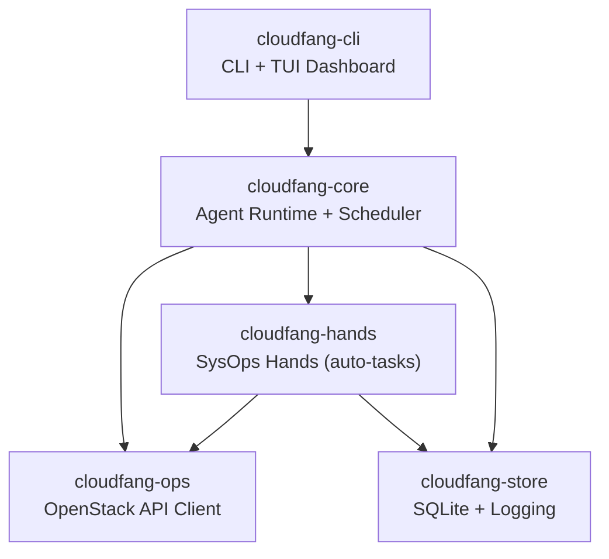

◊# CloudFang — OpenStack SysOps Agent (Implementation Plan)

Xây dựng phiên bản rút gọn của OpenFang, chuyên biệt cho **vận hành hệ thống đám mây OpenStack** (SysOps). Lấy cảm hứng từ kiến trúc OpenFang nhưng chỉ giữ lại những gì cần thiết cho ops.

## Tổng Quan Kiến Trúc

Từ 14 crates của OpenFang → **5 crates** cho CloudFang:



| Crate | Tương đương OpenFang | Mục đích |
|---|---|---|
| `cloudfang-core` | kernel + runtime | Agent loop, LLM client, scheduler, tool registry |
| `cloudfang-ops` | *(mới)* | OpenStack API client (Keystone, Nova, Neutron, Cinder, Glance, Heat) |
| `cloudfang-hands` | hands | 4 Hands tự trị: Monitor, Remediate, Backup, Scale |
| `cloudfang-store` | memory | SQLite persistence, incident log, audit trail |
| `cloudfang-cli` | cli | CLI commands, TUI dashboard, daemon mode |

---

## Proposed Changes

### 1. Workspace Setup

#### [MODIFY] [Cargo.toml](file:///Users/leanhvu/Desktop/Dev/Rust/Cargo.toml)
Chuyển thành Rust workspace với 5 member crates. Giữ lại các dependency cốt lõi (`tokio`, `serde`, `async-openai`, `anyhow`, `tracing`) và thêm:
- `reqwest` — HTTP client cho OpenStack REST API
- `chrono` — Xử lý thời gian
- `rusqlite` — SQLite persistence
- `clap` — CLI argument parsing
- `ratatui` + `crossterm` — TUI dashboard
- `cron` — Cron schedule parser

---

### 2. Core Crate — `cloudfang-core`

#### [NEW] [crates/cloudfang-core/src/lib.rs](file:///Users/leanhvu/Desktop/Dev/Rust/crates/cloudfang-core/src/lib.rs)

Module chính chứa:
- **`agent.rs`** — Agent loop: nhận task → gọi LLM → chọn tool → thực thi → report
- **`llm.rs`** — LLM client wrapper (OpenAI-compatible, hỗ trợ Ollama local)
- **`scheduler.rs`** — Cron-based task scheduler cho Hands
- **`tools.rs`** — Tool registry: đăng ký các OpenStack operations làm tools cho LLM
- **`config.rs`** — Config từ `cloudfang.toml` (OpenStack credentials, LLM settings, schedules)

---

### 3. OpenStack Operations — `cloudfang-ops`

#### [NEW] [crates/cloudfang-ops/src/lib.rs](file:///Users/leanhvu/Desktop/Dev/Rust/crates/cloudfang-ops/src/lib.rs)

OpenStack API client, xác thực qua **Keystone v3**, gọi các service:

| Module | OpenStack Service | Operations |
|---|---|---|
| `keystone.rs` | Identity (Keystone) | Auth token, list projects/users |
| `nova.rs` | Compute (Nova) | List/create/reboot/migrate VMs, get console log |
| `neutron.rs` | Network (Neutron) | List networks/subnets/ports, check floating IPs |
| `cinder.rs` | Block Storage (Cinder) | List/create/snapshot volumes |
| `glance.rs` | Image (Glance) | List/check images |
| `heat.rs` | Orchestration (Heat) | Stack status, deploy/update stacks |
| `metrics.rs` | Ceilometer/Gnocchi | CPU, memory, disk, network metrics |

---

### 4. SysOps Hands — `cloudfang-hands`

#### [NEW] [crates/cloudfang-hands/src/lib.rs](file:///Users/leanhvu/Desktop/Dev/Rust/crates/cloudfang-hands/src/lib.rs)

4 Hands tự trị — mỗi Hand có `HAND.toml` manifest:

| Hand | Schedule | Chức năng |
|---|---|---|
| **Monitor** | Mỗi 5 phút | Check VM health, disk usage, network latency, service status → alert |
| **Remediate** | Event-driven | Tự động xử lý sự cố: restart VM, clear disk, reconnect network |
| **Backup** | Daily 2 AM | Snapshot VMs/volumes quan trọng, cleanup snapshots cũ |
| **Scale** | Mỗi 15 phút | Phân tích load metrics → đề xuất/thực hiện scale up/down |

Mỗi Hand chạy theo flow:
```
[Schedule Trigger] → [Collect Data via cloudfang-ops] → [LLM Analysis] → [Execute Action] → [Log to cloudfang-store]
```

---

### 5. Storage — `cloudfang-store`

#### [NEW] [crates/cloudfang-store/src/lib.rs](file:///Users/leanhvu/Desktop/Dev/Rust/crates/cloudfang-store/src/lib.rs)

SQLite-based storage:
- **`incidents`** — Log sự cố và remediation actions
- **`snapshots`** — Tracking backup snapshots
- **`metrics_cache`** — Cache metrics cho trend analysis
- **`audit_log`** — Mọi action của agent (ai làm gì, khi nào, kết quả)

---

### 6. CLI — `cloudfang-cli`

#### [NEW] [crates/cloudfang-cli/src/main.rs](file:///Users/leanhvu/Desktop/Dev/Rust/crates/cloudfang-cli/src/main.rs)

```bash
cloudfang init                    # Setup config (OpenStack + LLM credentials)
cloudfang start                   # Start daemon
cloudfang status                  # Show system overview
cloudfang hand activate monitor   # Activate a Hand
cloudfang hand status             # Check Hand statuses
cloudfang ops vm list             # Direct OpenStack operations
cloudfang ops vm reboot <id>      # Reboot a VM
cloudfang chat                    # Interactive chat: "Which VMs are using >90% CPU?"
cloudfang incidents               # View incident history
```

---

## Cấu Trúc Thư Mục Cuối Cùng

```
Rust/
├── Cargo.toml                  # Workspace root
├── cloudfang.toml              # Runtime config
├── crates/
│   ├── cloudfang-core/
│   │   ├── Cargo.toml
│   │   └── src/
│   │       ├── lib.rs
│   │       ├── agent.rs
│   │       ├── llm.rs
│   │       ├── scheduler.rs
│   │       ├── tools.rs
│   │       └── config.rs
│   ├── cloudfang-ops/
│   │   ├── Cargo.toml
│   │   └── src/
│   │       ├── lib.rs
│   │       ├── keystone.rs
│   │       ├── nova.rs
│   │       ├── neutron.rs
│   │       ├── cinder.rs
│   │       ├── glance.rs
│   │       ├── heat.rs
│   │       └── metrics.rs
│   ├── cloudfang-hands/
│   │   ├── Cargo.toml
│   │   └── src/
│   │       ├── lib.rs
│   │       ├── monitor.rs
│   │       ├── remediate.rs
│   │       ├── backup.rs
│   │       └── scale.rs
│   ├── cloudfang-store/
│   │   ├── Cargo.toml
│   │   └── src/
│   │       ├── lib.rs
│   │       └── models.rs
│   └── cloudfang-cli/
│       ├── Cargo.toml
│       └── src/
│           └── main.rs
└── src/                        # (giữ lại code cũ)
```

## Lộ Trình Phát Triển (Phased)

| Phase | Nội dung | Ước tính |
|---|---|---|
| **Phase 1** | Workspace + `cloudfang-ops` (Keystone auth + Nova basic) + CLI skeleton | 1–2 ngày |
| **Phase 2** | `cloudfang-core` (agent loop + LLM + tool registry) | 2–3 ngày |
| **Phase 3** | `cloudfang-hands` (Monitor Hand đầu tiên) + `cloudfang-store` | 2–3 ngày |
| **Phase 4** | Các Hands còn lại + TUI dashboard + polish | 3–5 ngày |

> [!IMPORTANT]
> **Cần xác nhận từ bạn:**
> 1. Bạn có sẵn OpenStack cluster để test không? (Nếu không, tôi sẽ thiết kế mock mode)
> 2. Bạn muốn dùng LLM nào? (OpenAI API / Ollama local / cả hai?)
> 3. Tên dự án **CloudFang** có OK không, hay bạn muốn tên khác?
> 4. Bạn muốn bắt đầu từ Phase nào trước?

## Verification Plan

### Automated Tests
- Mỗi crate sẽ có unit test: `cargo test --workspace`
- Integration test Keystone auth flow (mock server hoặc real OpenStack)
- Test scheduler tick + Hand lifecycle

### Manual Verification
- `cargo build --workspace` — biên dịch toàn bộ 5 crates không lỗi
- `cargo clippy --workspace -- -D warnings` — zero warnings
- `cloudfang ops vm list` — gọi thật tới OpenStack endpoint (hoặc mock)
- `cloudfang hand activate monitor` — Hand chạy 1 cycle và ghi log
